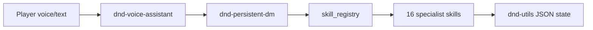

# Playing D&D with Grok

A short guide for players and DMs using the Grok iOS app (or Grok Build) with this skill pack.

## Start in 30 seconds

1. Open **Grok** and say: **"Let's play D&D"** or **"DM mode — campaign Shadowmere"**
2. Grok loads or creates your campaign automatically.
3. Play naturally: explore, fight, rest, talk to NPCs. Grok handles dice, HP, loot, and session saves behind the scenes.
4. End scenes with your action — Grok will ask **"What do you do?"**

### Voice play (Grok iOS)

Say **"Start voice D&D"**, then speak normally:

- *"Roll stealth with advantage"*
- *"Goblin takes 8 damage"*
- *"We take a long rest"*
- *"What quests do we have?"*
- *"End session — we cleared the mine"*

Grok keeps replies short and confirms HP/XP changes out loud.

## What Grok remembers

Your campaign lives at:

- **Windows / Mac:** `~/.grok/artifacts/dnd-campaigns/[Campaign Name]/`
- **Grok cloud:** auto-resolved by the skills (no path setup needed)

Each campaign stores:

| Data | What it tracks |
|------|----------------|
| Character sheet | HP, XP, inventory, conditions |
| World state | Location, time, tabletop vs kingdom mode |
| Combat | Initiative and HP during fights |
| Quests & hooks | Active objectives |
| NPCs | Personalities and relationships |
| Lore & recaps | What happened last time |

## Common things to say

| You say | Grok does |
|---------|-----------|
| "Show my character" | Reads your sheet |
| "Start combat — goblin ambush" | Initiative tracker |
| "I attack with advantage" | Rolls and applies damage |
| "Generate loot CR 3" | Treasure + anti-duplicate ledger |
| "What's the rumor mill?" | World hooks from campaign state |
| "Wrap up the session" | Recap, XP, audit, save |
| "Kingdom turn" | Advances domain projects + rumors |

## Architecture (simple view)



- **dnd-persistent-dm** — your DM; routes everything
- **dnd-utils** — saves campaign data safely
- **Specialists** — combat, dice, loot, NPCs, lore, rules, etc.
- **Playbooks** — multi-step flows (session end, kingdom turn, end combat)

## Tips for great play

- **Confirm big changes** — Grok will ask before ending a session or leveling up.
- **Name your campaign** — makes resuming easy: *"Continue Shadowmere"*
- **Kingdom mode** — say *"Switch to kingdom mode"* for domain management.
- **Long campaigns** — init with SQLite for faster event search: Grok can enable this on new campaigns.

## For tinkerers

Repo: [github.com/Omen2183/Grok](https://github.com/Omen2183/Grok)

```powershell
# Install skills
.\install.ps1 -Global

# Campaign dashboard
python .grok/skills/dnd-utils/scripts/dnd_state_utils.py dashboard "My Campaign"

# Analytics
python .grok/skills/dnd-utils/scripts/dnd_state_utils.py analytics "My Campaign" --report tags

# Health checks
python scripts/smoke_test.py
python -m pytest -q
```

See `README.md` and `AGENTS.md` for developer details.