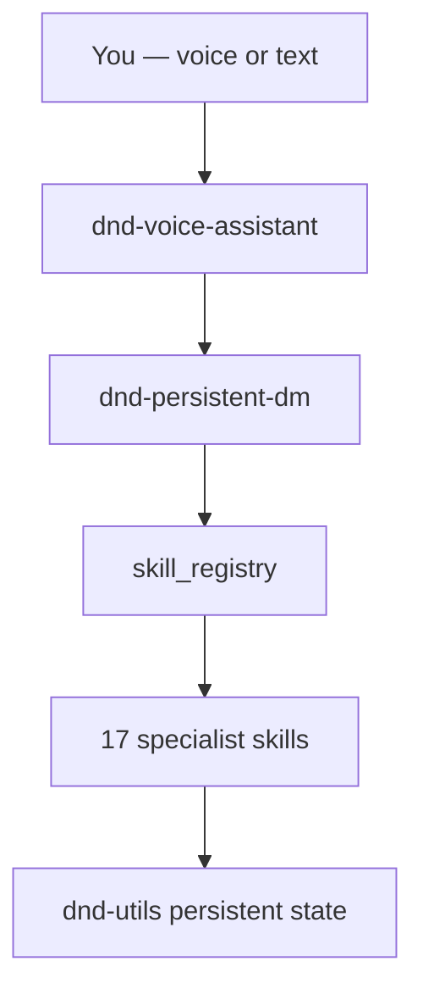

# Your D&D Companion on Grok iOS

*A table-grade toolkit for Dungeons & Dragons 5e — built for voice and text play on Grok.*

Whether you are rolling your first d20 or running a kingdom across dozens of sessions, this suite handles the bookkeeping so you can focus on the story.

---

## Begin play in one breath

Open **Grok** and say:

> **"Let's play D&D"**  
> or  
> **"DM mode — campaign Shadowmere"**

Grok loads your campaign (or creates one), recalls where you left off, and opens the scene. End every beat with your choice — Grok closes with **"What do you do?"**

### Voice mode

> **"Start voice D&D"**

Then speak naturally:

| Say this | Grok handles |
|----------|--------------|
| *"Roll stealth with advantage"* | Dice + narration |
| *"Goblin takes 8 damage"* | Combat HP sync |
| *"We take a long rest"* | Rest, slots, rumors |
| *"Random party level three"* | Full party generator |
| *"Wild magic surge"* | Surge table roll |
| *"What quests are active?"* | Quest tracker |
| *"End session — we cleared the mine"* | Recap, XP, save |

Replies stay short. Mechanical changes are spoken aloud.

---

## What persists between sessions

Your campaign lives at `~/.grok/artifacts/dnd-campaigns/[Campaign Name]/` (auto-resolved on Grok cloud).

| Saved data | Purpose |
|------------|---------|
| Character sheet | HP, XP, inventory, spell slots, conditions |
| World state | Location, time, tabletop vs kingdom mode |
| Combat tracker | Initiative, grid, HP mid-fight |
| Quests & hooks | Active objectives and rewards |
| NPCs | Personality, secrets, relationships |
| Lore & recaps | Searchable campaign memory |
| Loot & random ledgers | No duplicate treasure or table repeats |

---

## The 17-skill toolkit



| You want… | Say something like… |
|-----------|---------------------|
| Character & leveling | *"Show my sheet"* · *"Level up"* |
| Combat | *"Start combat — goblin ambush"* · *"Next turn"* |
| Dice | *"Attack with advantage"* · *"Roll perception"* |
| Treasure | *"Generate loot CR 3"* · *"Random magic item"* |
| World & rumors | *"What's the rumor mill?"* · *"Kingdom turn"* |
| Chaos & tables | *"Surprise me"* · *"Random dungeon"* · *"Roll travel complication"* |
| Rules | *"How does grappling work?"* |
| Session end | *"Wrap up the session"* |

---

## Play modes

**Tabletop (default)** — classic adventure: explore, fight, rest, roleplay.

**Kingdom mode** — domain management: projects, factions, world events. Say *"Switch to kingdom mode"* or *"Kingdom turn"*.

**Chaos one-shot** — Say *"Chaos campaign"* or *"Surprise me with everything"* for a random world, PC, hook, and encounter. Grok confirms before overwriting your sheet.

---

## Tips from the DM's screen

1. **Name your campaign** — *"Continue Shadowmere"* resumes instantly.
2. **Confirm big moves** — level-ups, session end, and `apply-character` always ask first.
3. **Balanced vs chaos** — *"Balanced loot"* uses CR scaling; *"random item"* is pure surprise.
4. **Long campaigns** — new campaigns can enable SQLite for faster lore search.
5. **Voice clarity** — name targets clearly: *"Aria heals Thorin for 9."*

---

## For DMs running at the table

- **Travel days:** *"Roll a travel day"* — weather, complication, terrain, social scene in one batch.
- **Dungeon crawl:** *"Random dungeon floor"* — rooms, traps, foes, exits.
- **Party generator:** *"Roll up a party of four at level 5"* — cultural names, class kits, stats.
- **Wild magic:** *"Wild magic surge"* after sorcerer surge or DM whim.
- **Custom tables:** homebrew entries persist per campaign; export/import for sharing.

---

## Install & verify (optional)

Repo: [github.com/Omen2183/Grok](https://github.com/Omen2183/Grok)

```powershell
.\install.ps1 -Global
python .grok/skills/dnd-utils/scripts/dnd_state_utils.py dashboard "My Campaign"
python -m pytest -q
```

See `README.md` for developer docs.

*Built for Grok iOS. Compatible with homebrew and official 5e tone — not affiliated with Wizards of the Coast or Hasbro.*